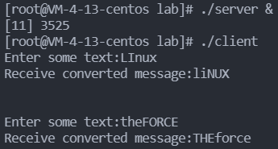

# Lab07 Assignment

> 班级：
> 学号：
> 姓名：

## 1. 请实现这样一个程序

请实现这样一个程序：客户端进程（Client）和服务器进程（Server）通过**消息队列**进行通信，消息队列共有两个，Up 和 Down，如下图所示：


客户端进程接受用户从终端的输入，并通过Up消息队列将消息传递给服务器进程，然后等待服务器进程从Down消息队列传回消息。服务器进程从Up接收到消息后将大小写字母转换，并通过Down传回给客户端进程，客户端随后输出转换后的消息。（例如：客户端通过Up发送'linuX', 将从Down接收到'LINUx'）。多个客户端同时使用Up和Down消息队列时也应该能够正常工作，因此需要使用消息类型mtype区分来自不同客户端的消息。要求程序输出如下的效果：




```c
//code

```

截图：


## 2. 请实现这样一个程序

请实现这样一个程序：一个进程创建3个子进程，每个子进程都打印你的学号，但要求每个进程都打印完这一位数字后，才能有进程开始下一位数字的打印。例如，我的学号是`18373455`，那么输出结果应该是`111888333777333444555555`。仅允许使用**信号量**作为同步工具。


```c
//code

```

截图：


## 3. 请实现这样一个程序

在《Linux编程基础》一书对共享内存的讲解中，其给出的例子是一个进程向共享内存写，然后终止，然后再启动一个进程从共享内存中读。请实现这样一个程序：同时使用**信号量**和**共享内存**实现一个这样的功能，同时运行两个进程，一个进程向共享内存中写入数据后阻塞，等待另一个进程读，再写，然后再读。要求程序输出如下的效果：


一共要求输出10组，30行，`read`行之后有一空行，以便于明显区分组别；`write`和`read`后面的数字请不要显示明显的规律性，请使用`rand()`函数获取，并一定在调用`rand()`函数之前，使用`srand(unsigned int seed)`重置随机种子，其中，`seed`为你的学号。


```c
//code

```

截图：


## 4. 实验感想
